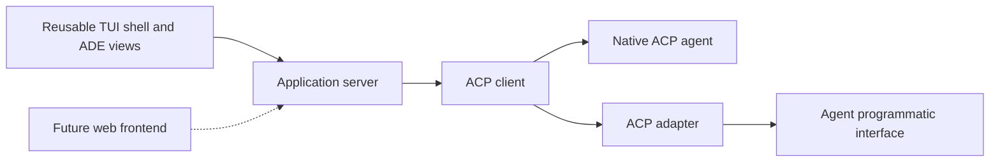

# ADE and agent integration

Status: headless Codex/Claude, ACP v1, one chosen agent per thread, background-server ownership, and application-home SQLite persistence are accepted. The [first ACP slice](go-slice.md#acp-agents--2026-09-22) has bounded live evidence. The 2026-09-22 [official-runtime decision](../adr/0014-acp-boundary-official-agent-runtimes.md) and [question normalization](../adr/0015-app-owned-question-contract.md) guide the next slice; exact adapters and remaining wire/recovery details need implementation work.

The application server owns the live ADE and ACP connections. The TUI is an attachable frontend; closing it leaves work running, and reopening catches up. A future web frontend uses the same application boundary. [Server design](server.md)

## Boundary

The agent development environment owns its native thread and activity UI. It connects to headless agents using Agent Client Protocol (ACP). An agent implementing ACP can connect directly; another agent needs an adapter that translates its supported programmatic interface. This is the architecture selected in [ADR 0002](../adr/0002-acp-agent-boundary.md).

**Thread** is the user-facing term chosen by the user, and each thread has one chosen agent. ACP still calls its protocol objects sessions; preserve that terminology in wire names and upstream references. Session creation, restoration, and reconnection must preserve the thread's agent identity. A model is not the same thing as an agent; model-setting details remain separate.

Each reference app includes its own native server and TUI, implementing this boundary idiomatically through the shared authenticated HTTP/WebSocket application contract. Multiple clients may attach. The diagram does not require a shared process, cross-language library, or bespoke adapter implementation. Non-ADE consumers can use the shell without ACP.

## Integration direction

Codex and Claude are the initial required agent examples. Use official local
Claude Code and official `codex app-server` behind ACP. Compare direct
`claude -p` with the Agent SDK, which runs a local Claude Code binary; verify
permitted authentication/use before selecting the SDK. SDK-versus-CLI choice
does not determine billing. Keep login with the official runtime and do not
silently switch subscription users to API credentials.

Existing adapters remain candidates; reuse them where they meet the agreed
contract rather than automatically building translations. Exact ownership and
Claude's route remain open. The current Go prototype uses user-installed,
pinned external adapters under [ADR 0013](../adr/0013-server-owned-acp-agent-processes.md).
Compare those with the UCF reference implementation; see the
[evidence note](../research/agent-integration-options-2026-09-22.md) and
[implementation handoff](../implementation/agent-integration-handoff.md).
Copilot remains a researched native ACP example, not verified integration here.

Stable ACP v1 is the accepted baseline. Stdio is the recommended initial transport; v2 and standardized HTTP transport remain drafts in the source research. Provider-specific transports or negotiated extensions must be identified as such. Running the whole TUI remotely over SSH is a separate scenario from running the TUI locally with a remote agent endpoint. [Protocol research](../research/acp-protocol.md)

The initial thread stays with its chosen agent. Cross-agent switching and handoffs are deferred, including linked threads and handoff documents. The user's future idea is a seamless transition by writing context for another agent, within the same provider or another ACP implementation; it is recorded as future discussion rather than current scope. Selecting an agent for a separate Git conflict-resolution job does not replace the agent assigned to the original thread. Inspectable subagent runs are in scope: they are delegated work under that thread, not a handoff of its assigned agent.

Threads use the existing project checkout by default, with an explicit worktree option. See [workspace behavior](workspaces.md) for the settled default and the remaining coordination decisions.

Prompts submitted while a turn is active enter the thread's visible prompt queue; interruption is explicit. One turn covers a submitted prompt and its resulting work through completion, failure, or cancellation. Write-capable runs also pass through the server's shared checkout writer queue. Detaching a frontend does not cancel either queue or release an active run's checkout ownership.

“Another agent just works” means the client can establish an ACP connection, negotiate supported features, and present the operations the agent actually supplies. It does not mean every endpoint can restore history, receive images, steer an active prompt, provide checkpoints, or supply identical permissions. Missing functionality must be visible and explainable.

## Required user experience

- Use the [agent-first thread configuration flow](thread-configuration.md). Keep agent, model, effort, permissions, and applicable context/speed settings visible at the bottom of the prompt box, distinguishing selection from the active turn's confirmed values.
- Present streamed messages and tool activity in the center workflow; use file/Git surfaces to inspect related work.
- Present structured plan steps and subagent runs, including available child transcript/tool history. Keep the current plan and individually clickable running children above the prompt. Plans open the singleton Plan surface, children open Agents, and tool/MCP calls open Activity; provide keyboard equivalents. Completed children stay in Agents and history. See [activity presentation](activity.md) for summary/detail behavior and capability coverage.
- Allow the user to choose an available agent for an agent-assisted Git conflict-resolution job; show the selected agent throughout the job.
- Present agent permission requests and pending interactions without losing the current editor or Git context. Translate only what the negotiated protocol and adapter support.
- Present [blocking and asynchronous questions](questions.md) above the prompt, with question tabs and Back/Next navigation for batches. Keep the composer available. Both modes are required integration targets; report capability gaps until continued work and correlated later-answer delivery are verified.
- Use one application-owned question/answer contract across frontends. Prefer native structured responses; a declared turn-ending fallback may deliver a request-specific answer through a correlated new upstream turn. Preserve actual execution semantics and keep approvals distinct. A fallback does not satisfy the native blocking or true asynchronous integration targets.
- Preserve a distinct identity for the thread/turn and for the repository state being reviewed. Record a start/end comparison labelled changes observed during this turn; it may include external edits. Provider-reported edits and current/staged/branch diffs remain separately identified. Automatic rollback is deferred.
- Provide a consistently available [usage display](usage.md) for context occupancy/capacity, applicable subscription quotas, and reported API cost. Values come from the agent stream or adapter-forwarded telemetry; missing data is not zero and must not be filled by external lookups.
- Include optional inline graphics in the design. Terminal image rendering and an agent's image-input support are separate capabilities; one does not establish the other.
- Keep interactive terminal surfaces in the right and center-bottom panels distinct from the headless agent connection. ACP command-output facilities are not automatically a complete interactive terminal emulator.

## Correctness boundaries

Rendering a final-looking text message is not sufficient to declare a turn complete; follow the protocol lifecycle. Cancellation may have trailing output and is not rollback. Agent disconnects must not be reported as successful completion, and retrying an uncertain request must not silently duplicate side effects.

Agent tool reports can support review but do not prove that all changed files belong to one turn. Before/after snapshots also require a concurrency policy. A current Git diff, a historical observation, and changes attributed to an agent need distinct labels.

Client-mediated file access can interact with unsaved buffers; direct agent writes can bypass those methods. ACP capability negotiation is not a sandbox or an exclusive filesystem writer lock. These are constraints to account for when settling execution, concurrency, and buffer policies. [Protocol evidence](../research/acp-protocol.md)

## Remaining decisions

- Policy for optional extensions and minimum capabilities for an agent to count as fully supported; ACP v1 itself is settled.
- Final adapter ownership, Claude SDK-versus-direct-CLI selection, verified authentication eligibility and supported upstream versions. Codex App Server is selected; the current prototype's user-owned installation policy remains in force pending an explicit change.
- Prompt queue advancement after interruption and session restoration for a thread's chosen agent. Editing, removing and reordering waiting prompts until execution starts are accepted; dispatch/race mechanics require implementation design. Turn definition and queue-first behavior are settled; handoffs are deferred.
- Detailed writer scheduling/fairness, optional worktree lifecycle, file access mediation, and permissions/execution boundaries.
- Detailed server recovery, durable command acceptance, and coherent catch-up implementation. Background ownership, graceful cancellation on explicit stop, application-home SQLite, multiple clients, and loopback HTTP/WebSocket with SSH forwarding are settled.
- Turn comparison capture boundaries and coverage limits. Recorded start/end comparison is accepted; rollback is deferred.
- Conflict-job cancellation/recovery and exact context delivery. The corrected Q10 requires stopping for user review after edits and before staging/continuation.
- Usage-display placement, telemetry field mappings, and any negotiated adapter extensions; keep separate resolution-job usage identifiable. Required measurements and source restrictions are settled in [usage display](usage.md).

The [interview](interview.md) records decisions as they are made. The
[ACP validation report](../research/go-acp-2026-09-22.md) records bounded runtime
checks; it does not establish full capability or cross-language conformance.
