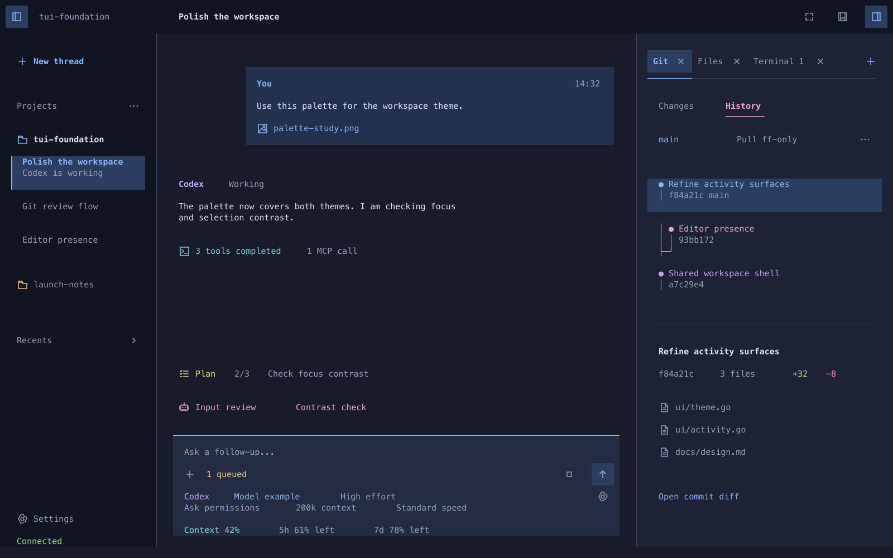

# Visual design

Implementation evidence (2026-09-19): the [first Go slice](go-slice.md) now exercises a fixture-driven subset of this contract. See the [validation report](../research/go-slice-validation-2026-09-19.md) for executed checks and limitations; provider/editor/real-terminal behavior below is not implied by fixture results.

Status: **the user approved revision 3's visual direction before the gap review**. Keep the richer palette informed by Omarchy/herdr, with calmer composition, persistent pane controls, and surfaces opened on demand. The original monochrome direction and revision 2's dense collection of cards and invented avatars are superseded. The subsequent behavior decisions are recorded in the specification; exact terminal geometry, icon legibility and interactive tuning remain prototype work. Actual terminal rendering and interaction remain **NOT RUN**.

## Revision 3 references

[Multiple terminals](visuals/workspace-terminal-dark.png) · [Maximized surface](visuals/workspace-maximized-dark.png) · [Add surface chooser](visuals/workspace-chooser-dark.png) · [Empty host hidden](visuals/workspace-none-dark.png) · [Bottom panel open](visuals/workspace-bottom-dark.png) · [Image/file surface](visuals/workspace-files-dark.png) · [Light variant](visuals/workspace-light.png) · [Dark SVG](visuals/workspace-dark.svg)

[Agents surface](visuals/workspace-agents-dark.png) · [Plan surface](visuals/workspace-plan-dark.png) · [Blocking questions](visuals/workspace-questions-blocking-dark.png) · [Asynchronous questions](visuals/workspace-questions-async-dark.png) · [Questions while maximized](visuals/workspace-maximized-questions-dark.png)

These original illustrations use a 160-column by 50-row nominal grid, square pane regions, one monospace text size, and a bounded raster image preview in the Files example. Each view demonstrates a particular state; the main example has Git, Files and Terminal 1 tabs with Git selected. Additional references show two terminal tabs and a maximized terminal. A fresh empty host and the bottom panel start hidden. Geometry and colors are candidate tokens, not minimum terminal dimensions. Names, Git objects, settings, telemetry, and activity are sample content. Agent identities use text pending packaged official assets; the rejected invented user/agent avatar art has been removed.

The previous grayscale/single-accent renderings are rejected references. Future agents must not use them as the beauty target or treat “restrained” as a requirement to remove color and identity.

## Composition and visual hierarchy

Keep Codex's clear workspace organization while giving the content recognizable roles. Use a coordinated family of colors rather than tinting every label with the same accent. Quiet canvas and navigation backgrounds support richer message surfaces, clear selected rows, colored file/branch indicators, and purposeful images. Square edges and terminal cells can still support polished composition.

Ordinary user and agent messages use alignment and tint to establish role without repeated “You” or agent-name headers. Keep prose readable and preserve meaningful tool/MCP identities and detail labels. Avoid nested bordered cards and invented avatars; compact activity opens full detail in its inspector.

| Content | Revision 3 treatment | Detail access |
| --- | --- | --- |
| User message | Inset, end-aligned blue-tinted message and optional attachment; no repeated author header | Open attachment preview |
| Agent response | Readable prose with distinct alignment/tint; no repeated agent header | Select/copy text; inspect supplied content |
| Plan | Compact current step and progress fixed above the prompt | Singleton Plan surface with full plan and retained revisions |
| Tools/MCP | One concise related-activity group with status and supplied MCP count | Individual call identities, arguments, output, errors |
| Subagents | One Agents summary with a state circle fixed above the prompt | Singleton Agents surface with children, full available transcripts and tools |
| Questions | One question page above the prompt, with question tabs and explicit answer submission | Source request, preserved answers, meaningful blocking/async state |
| Git | One active mode, colored graph lanes and a selected commit summary | Commit diff, working changes, graph actions |
| Composer | Input with flat setting values, one settings action and compact usage | Supported configuration pickers and usage detail |

The normal thread view does not need to show every tool target, every child transcript, every Git mode, and every available surface simultaneously. A collapsed group must still expose a failure, approval request, or unresolved child interaction. Details remain accessible by activating the row; compact presentation is not permission to discard history. An expanded child list has a distinct entry for each child.

Keep chronology intact when grouping activity. A collapsed tool group summarizes related calls beneath its owning run; it must not move later events ahead of earlier user messages. Expanding or inspecting preserves that relationship and the complete retained detail. The right sidebar and subagent transcript reuse the same role language.

Keep a fixed area immediately above the prompt, outside transcript scrolling, with one Agents summary, a compact Plan summary and pending requests. Show “Agents” with a pulsing blue circle for established active work. Only when every child has successfully completed, use a solid green circle; retain the summary until explicitly dismissed. On hover or keyboard focus, the completed circle becomes an X in the same leading icon slot. Only that slot dismisses; the label still opens history. Keep the working count and full state in hover/focus help and the inspector. Never offer dismissal while work is unfinished. Activating the summary opens the singleton Agents surface, where individual children and full available history remain accessible. Plan uses completed/total progress (n/N), the same blue working and solid green all-completed states, and the same completed-only dismissal. Failed, interrupted, waiting, stale and unknown states stay distinct and never imply success. Dismissal belongs to the frontend thread view; new work or a changed group/plan reopens its summary, while unrelated stream updates do not. Render both summaries in one shared tinted band with consistent text colors. Blue pulsing and green solid circles carry activity state alongside meaningful labels; exceptional states remain distinct. Earlier illustrations with individual chips or repeated author headers are historical, superseded by this correction.

Question batches show one page at a time. Top question tabs identify progress; Back/Next appear only for real adjacent questions and only navigate, while Submit explicitly delivers the request's response. Vertical radio choices advance automatically, checkboxes stay on their page, and supported Other/free text stays editable inside a bounded outlined card. Keep the normal prompt, its draft, settings and usage available below. “Waiting for answer” identifies a blocking request; “Answer anytime” identifies verified continued-work delivery. Pending requests need access even with a maximized surface or reduced height. The [question contract](questions.md) governs request selection, drafts, validation, execution scope and delivery; these illustrations do not establish agent support.

## Color and tokens

Use semantic theme roles for canvas, navigation, panel, input, primary/muted text, selection, focus, each activity role, and success/warning/error. The illustrated dark palette uses navy surfaces with blue, violet, cyan, peach, and pink accents; the light variant uses pale surfaces and darker related inks. These are candidate mappings, not a requirement to copy an upstream theme or brand palette exactly.

Use stronger color on small identity/status areas and quieter tints over large backgrounds. Keep ordinary prose readable. Role color and status color are different: a violet agent is not “running” merely because it is violet, and a pink branch is not an error. Retain labels for state and permission modes. Never rely on hue alone to distinguish user, agent, tools, changes, or focus.

The accepted SSH color refinement uses explicit neutral surface indices for
256-color and 16-color terminals instead of quantizing large navy RGB areas into
saturated blue. Preserve both themes, message alignment, wrapping and controls
across profiles. Working circles may use stepped brightness when smooth RGB
interpolation is unavailable. Honor nonempty `NO_COLOR`; terminal palette slots
can be customized, so exact low-color appearance still depends on the terminal.
Use supported, bounded capability detection to upgrade without blocking input or
persisting a terminal's capabilities in a named client view. See the
[Go implementation and evidence](../research/go-colors-2026-09-20.md).

## Pane controls and surface chrome

Keep the left-navigation toggle at top-left. The three top-right controls are ordered **maximize/restore right surface, center-bottom toggle, right-panel toggle**. Maximize acts on the right host's active surface; restore returns to the prior layout. Its control stays in application chrome rather than moving into the surface header. Show maximize only while the right host is actually visible; a visible empty chooser can maximize using the same geometry. Keep the controls and ADE prompt/configuration/usage footer reachable while maximized. Each icon's state, focus and hover label identify its action; hit areas cover a comfortable cell rectangle. All controls have keyboard paths, with exact bindings still deferred.

Omit global content search. The subsequently requested project selector opens its own name/path search; the adjacent folder-plus action adds a project. Closed replaces Recents, has a single compact disclosure control and can also be hidden/restored through navigation options. Thread rows use pulsing blue working, yellow/orange attention, red error and solid green finished circles. Only finished/idle, closable rows reveal a Close check on hover/focus; Closed rows reveal trash. Keep these separate from the label and vertical ellipsis menu. Ordinary thread rows do not need chevrons. Activity rows open their details through full-row activation with hover/focus highlighting; omit the repeated split-panel inspector icons that were confused with the sidebar toggle. Reserve disclosure marks for actual inline expansion and pane icons for pane controls. Do not put a literal `v` on every setting.

The right host is an explicit tab strip. Every surface has a labelled tab, its own × close control, and access to the same global maximize/restore action. The active tab has a clear selection state. Add sits beside the tabs. Each non-terminal type has at most one tab in that host: Git, Files, Agents, Plan, Activity and future non-terminal types focus their existing tab when opened again. Only Terminal repeats; New terminal can create distinct Terminal 1, Terminal 2 and later instances. File buffers and inspector selections are internal content, not duplicate Files, Agents, Plan or Activity surface tabs. Terminals also remain usable in the center-bottom panel. Do not permanently display unopened surface types. Overflow must keep tab activation and closing reachable without shrinking labels or hit targets beyond usability. Add opens the chooser; last-close hides the host; explicitly showing an empty host keeps the chooser visible. Hiding preserves opened surfaces and their state. See the accepted [layout lifecycle](layout.md).

For Terminal tabs, × means close the terminal session. The bottom terminal also has its own session-close control. The top-right pane icons hide/show their regions and preserve the shells. Keep these targets visually and semantically distinct; the bottom close icon must not be labelled Hide bottom panel. See [terminal lifecycle](layout.md#terminal-close-and-panel-hide).

## Interface copy

Show content and useful controls directly. Omit explanatory filler beside self-evident values or output: “Running with selected settings,” “Only opened surfaces appear here,” and generic progress narration add no decision-relevant information. Matching selected/running settings display once; label the difference only when values differ. Keep meaningful statuses, units, failures, stale data, permissions and recovery actions. Concision must not erase a distinction the user needs to act.

Keep mockup provenance and implementation-status notes in the surrounding documentation, outside the depicted application. Tooltips and focus help may name an icon's action; they should not become permanent captions describing the layout.

## SVG icons and kitty graphics

Use **SVG as an asset source**, rasterized to transparent PNG/pixels for negotiated terminal-image display. Kitty does not consume raw SVG. Small pane, file, inspect and status controls share a consistent line-icon family; the source need not depend on which icon font the user installed. Use raster controls where their placement is verified and validated glyph/text equivalents otherwise. The illustrated SVG paths describe the intended icon language, not glyphs supplied by Menlo. [Protocol and asset evidence](../research/visual-enhancements.md)

Agent identity should use official product artwork when available and suitable for redistribution, accompanied by its name. Keep the product/connection, provider and model identities distinct: Codex is not automatically ChatGPT, GitHub Copilot is not Microsoft Copilot, and changing a model does not change the thread's agent mark. Record asset source, identity, version and usage terms. Do not draw approximate vendor logos. Use a clean text label when a verified asset is unavailable. Use a real user avatar only when supplied/configured; ordinary messages omit repeated author headers, and no synthetic mascot is used.

Rasterization happens on asset/theme/cell-geometry changes, not every frame. Cache by asset revision, permitted theme variant, target pixel dimensions and scale. Preserve the artwork's proportions and avoid unapproved recoloring. Small icons must remain recognizable at real terminal sizes. Hit testing belongs to the layout's measured cells, independent of the image pixels.

The rich presentation remains the intended experience on capable terminals. Image attachments, image-file previews, and supported agent brand marks are useful bounded placements. Displaying an image is distinct from sending image input to an agent. Negotiate graphics separately from keyboard/mouse support; current Ghostty and iTerm2 documentation supports a rich-image direction, while exact local/SSH/tmux paths remain untested.

The renderer owns image placement, clipping and removal on scroll, resize, overlays, pane changes and exit. Reserve geometry before loading an image and reuse its transmitted data where supported. Keep text selectable; never rasterize the whole conversation to obtain the appearance. Transmit bytes when the terminal and app do not share a filesystem. The fallback retains theme colors, labels, state, attachment metadata and usable controls; rich styling remains a requirement even when particular paths need fallback.

## References and translation

[T3 Code's local source and bundled screenshot](../research/t3-code-design.md) provide an additional concrete reference: stable corner toggles, opened surface tabs with an add menu, a deliberate empty launcher, small SVG identity assets, compact tool groups and a consistent composer footer. Revision 3 uses that calmer composition while retaining the color requested through Omarchy/herdr. The T3 review records the inspected commit and source lines; its search, surface inventory, compact overflow rules and bindings do not override this project's accepted choices.

[Omarchy's official theme previews](https://omarchy.org/manual/themes/) show coordinated palettes across its desktop and terminal tools. [Herdr's published screenshot](https://github.com/herdrdev/herdr/blob/master/assets/screenshot.png) demonstrates terminal pane hierarchy, colored headers, agent identity, and compact prompt status. The [plugin gallery](https://plugins.omarchy.org/) and [Omagram preview](https://plugins.omarchy.org/plugin.html?id=reidenxerx.omagram) add useful examples of framed media, identity, and compact controls.

The inspected Omarchy plugin authoring contract uses Quickshell/QML graphical panels. Their visual ideas inform this design; the plugin renderer is not a terminal library we can directly reuse. Color/cell composition and bounded raster placements are the translation paths here. [Detailed precedent notes](../research/interaction-precedents.md)

## First implementation review: font controls and tabs

The user requests recognizable Nerd Font controls with open/closed pane variants, using T3/Codex as the reference for pane and tab behavior. The Go slice uses the Codicons family from the pinned Nerd Fonts 3.4.0 glyph map, with an explicit ASCII fallback. These are interface symbols; provider identity continues to require verified official assets. Tab type icons swap to close targets on hover or keyboard focus, overflow appears only for hidden tabs, and the overflow menu uses one row per surface. See the [accepted interaction refinement](layout.md#controls-and-composer-refinement-2026-09-19) and [implementation evidence](../research/go-controls-2026-09-19.md).

## Visual acceptance and reproducibility

The visual direction is approved. Inspect actual Go terminal captures beside it: wide/ordinary/narrow layouts, both themes, pane resizing, menus, selection, multiline messages, tool bursts, subagent inspection, graphics scrolling/clipping, Markdown/raw editing, and Git conflicts. Compare role recognition and reading comfort alongside palette values. Exact key bindings remain deferred to the interactive prototype.

Include the gap-review states in interactive and visual validation: background attention, distinct approvals, attachment and queue editing, per-prompt settings, thread restoration, terminal close versus panel hide, and crowded activity. Tight layouts use compact Plan and Agents summaries and one scrollable question/approval card while keeping the prompt, settings and usage visible. Existing illustrations establish the approved direction; these additional combinations still need prototype captures and runtime checks.

[render_reference.py](visuals/render_reference.py) generates these SVGs, original raster assets, and PNG previews using Python 3, Node.js, and `sharp`. These are documentation tools, not chosen TUI dependencies. With `node` and `sharp` resolvable, run `python3 docs/design/visuals/render_reference.py`; `TUI_REFERENCE_NODE` and `TUI_REFERENCE_SHARP` may point to existing runtime/package paths. Text uses the system's Menlo/monospace font. No packages were added to the app.

The revision 3 references include 13 SVG/PNG pairs, adding Agents, Plan, blocking questions, asynchronous questions and questions during maximization. Visual review covers both themes, occupied/empty surfaces, the optional bottom panel, question paging and the preserved composer during maximization. On 2026-09-19, checks passed for all 40 project Markdown documents' local links, whitespace, fences and section headings; renderer syntax; all 13 SVGs' XML, text grid, bounds and embedded PNG assets; and rejected-copy absence. The terminal lifecycle update also verified distinct bottom-panel hide and terminal-session close labels; `git diff --check` passed. This is documentation and illustration validation, not evidence of a running TUI, passed mouse paths, working kitty transport or verified agent answer delivery.
