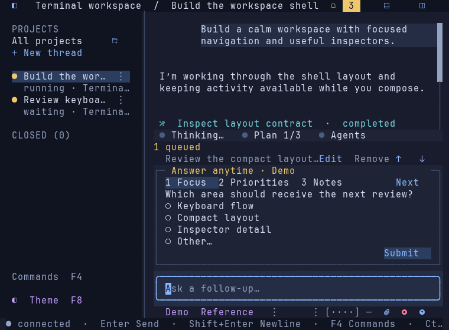
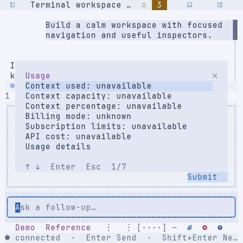
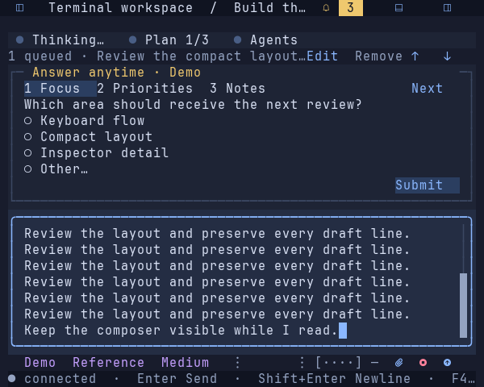
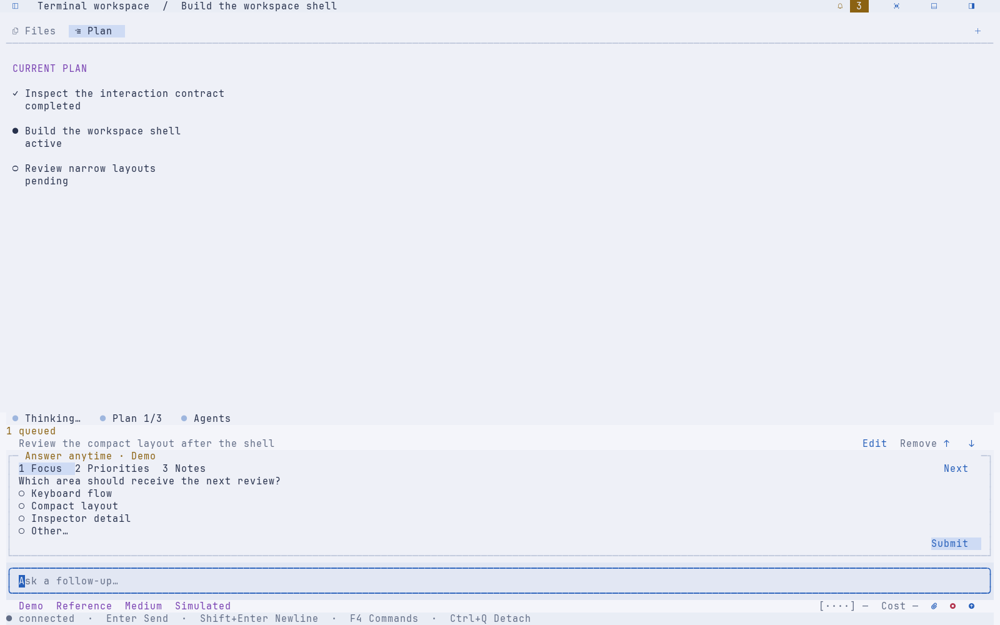

# Grouped composer overflow and input outline — 2026-09-20

The user clarified that overflow belongs beside the controls it expands.
Settings overflow now follows the remaining left-aligned fields; usage owns a
separate ellipsis at the far left of the right-aligned action group. Cost text
first collapses to an ellipsis beside the gauge, then the gauge collapses if
necessary. The usage control keeps its action and keyboard identity across
these transitions. The settings menu contains no usage or attachment actions.
Attachment, active Stop and Send remain on the right, with Stop/Send priority.

The usage menu opens directly with context occupancy, capacity, percentage,
billing mode, subscription limits and API cost, plus access to the existing
usage inspector. The fixture supplies no usage measurements, so those fields
remain unavailable/unknown. This is presentation work, not telemetry integration.

The follow-up request adds a complete outline around the typing area. Its lower
border clearly separates input from settings/actions, which now sit on the
canvas below. The outline uses blue when typing and a visible neutral color
otherwise. Existing inner gutters, growing text viewport and internal scrollbar
remain intact. The border uses the previous footer's spare row, so it does not
increase the total footer height or reduce the existing prompt cap.

Menus keep their selection through resize; opening/closing them does not change
the draft or settings. Rendering only computes presentation. No persistence,
server, dependency or protocol change is involved, and no Git pull/push was run.

## Validation

Validated on macOS darwin/arm64:

- `GOCACHE=/tmp/tui-go-build make check` passed formatting, vet, all race tests
  and the native binary build.
- Existing layout, request, draft, queue and lifecycle tests pass. Focused
  checks cover separate left/right groups with Nerd Font and plain icons,
  24–240-column footer layouts, hidden-setting reachability, stable keyboard
  focus and selection during resize, pointer/keyboard usage access, explicit
  unavailable measurements, and the input border/scrollbar at 48×22 and larger.
- `python3 scripts/pty_smoke.py --artifacts /private/tmp/tui-composer-groups-pty`
  passed all 35 native PTY checks with an isolated fixture server. New checks
  verify the complete input outline and the separate usage menu; the existing
  overflow mouse/keyboard, draft, resize and cleanup checks also pass. See the
  [report](go-composer-groups-captures/pty-report.json),
  [settings menu](go-composer-groups-captures/pty-settings-menu.txt) and
  [usage menu](go-composer-groups-captures/pty-usage-menu.txt).
- `TUI_GO_CAPTURE_DIR=/private/tmp/tui-composer-groups-captures GOCACHE=/tmp/tui-go-build go test ./internal/tui -run TestPolishedViewCaptures`
  generated 20 View frames. The four frames below were visually reviewed.

These are static renders of actual Go View output in JetBrains Mono Nerd Font
Mono Regular at 15 px on a 10×20 cell grid, with compressed ANSI/SVG sources
alongside. They are not GUI-terminal screenshots. Native PTY checks verify
input routing; exact Omarchy/SSH/tmux font and terminal combinations were not
retested. No real provider measurements were added.

Run `make build` then `./bin/tui-go` from `apps/go`; validation already rebuilt
the binary. Relaunch only the TUI to load these changes. A server restart is
unnecessary. Connecting real settings/usage remains part of the next ACP slice.

