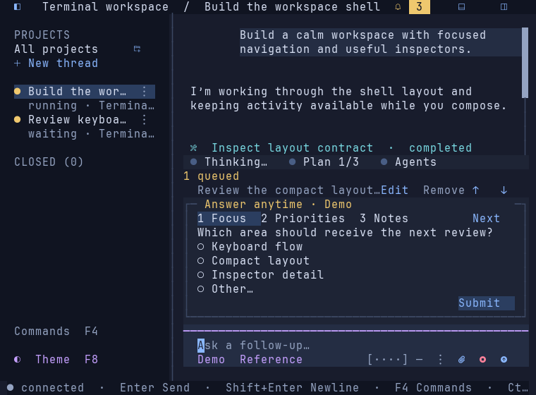
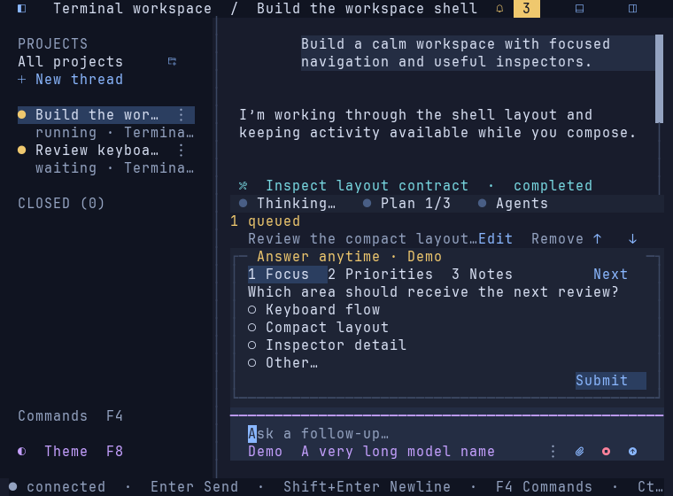
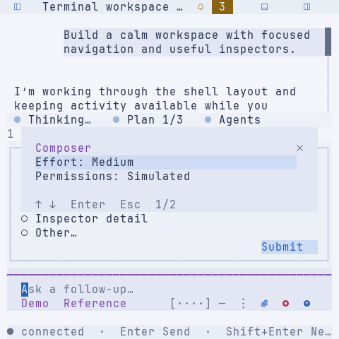

# Progressive composer overflow — 2026-09-20

The subsequent [grouping and outline correction](go-composer-groups-2026-09-20.md)
splits the shared overflow described below into settings and usage controls.

The user requested increasingly compact controls behind a vertical ellipsis as
the pane narrows. This supersedes the previous narrow wrapping behavior. The
prompt and footer retain their two-cell gutters; settings align left and
usage/attachment/Stop/Send align right in one footer row. The same layout is
used while a surface is maximized.

The implementation compacts the cost label first, then hides permissions,
context, speed, differing running values, the redundant Save edit label,
effort, usage, agent name and attachment controls as needed. Cancel/Retry/Resume
remain visible longer. Send, active Stop and the model have highest priority;
long model names truncate by terminal cells before moving into overflow. The
terminal still uses its existing 48×22 minimum-size fallback. The precise
collapse order is an implementation choice, not a new provider capability.

Only hidden controls appear in the menu, with names, values and their original
application actions. The ellipsis sits before the attachment/Stop/Send group;
it disappears when everything fits. Hidden recovery actions or differing
running settings tint it amber. A focused control that collapses moves focus
to overflow. The menu's item order stays fixed while open through resizing and
incoming activity; reopening recomputes its contents for the current width.
Resizing does not submit, discard drafts or alter captured settings. No storage,
server, dependency or protocol change is involved.

## Validation

Validated on macOS darwin/arm64:

- `GOCACHE=/tmp/tui-go-build make check` passed: gofmt, vet, all race tests and
  native build.
- Layout tests cover 240 down to 16 available columns with Nerd Font/plain
  icons, progressive hiding, no lost actions, shared row alignment and inset
  geometry. Long Unicode model labels preserve their full accessible name.
- Input tests verify pointer and keyboard access to hidden settings, focus
  transfer into overflow, stable menu selection across resize/background
  snapshots, and unchanged drafts/settings with no unintended submission.
  Existing request, queue, lifecycle and recovery tests pass.
- `python3 scripts/pty_smoke.py --artifacts /private/tmp/tui-footer-overflow-pty`
  passed all 33 checks with an isolated fixture server. The four added checks
  cover the narrow shared row, pointer opening of overflow, keyboard activation
  after resize, and draft preservation. See the [report](go-footer-overflow-captures/pty-report.json)
  and [captured menu text](go-footer-overflow-captures/pty-composer-menu.txt).
- `TUI_GO_CAPTURE_DIR=/private/tmp/tui-footer-overflow-captures GOCACHE=/tmp/tui-go-build go test ./internal/tui -run TestPolishedViewCaptures`
  generated 18 View frames. Four representative dark/light frames were
  visually reviewed below, covering the full row, progressive collapse, a
  longer model label and the menu.

These are static renders of actual Go View output, rendered with JetBrains
Mono Nerd Font Mono Regular at 15 px on a 10×20 cell grid. Adjacent compressed
ANSI/SVG files retain the source. They are not GUI-terminal screenshots; exact
Omarchy/SSH/tmux combinations were not exercised in this check. The native PTY
run verifies input routing, not font rendering or provider integration.

Rebuild with `make build` in `apps/go`, then run `./bin/tui-go`. The binary was
rebuilt by validation; relaunching only the TUI picks up the change. A server
restart is unnecessary. Real provider settings/usage remain the next integration
slice; this change only adapts the existing controls to available space.

