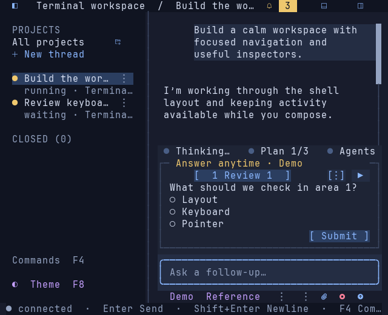
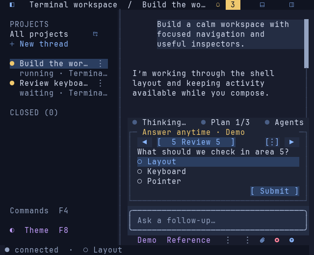
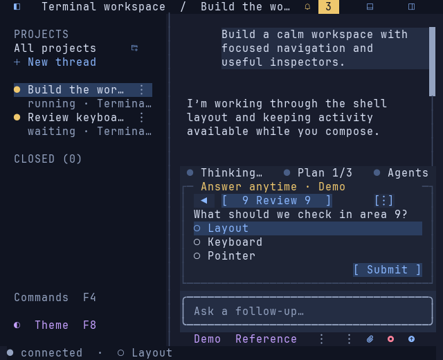
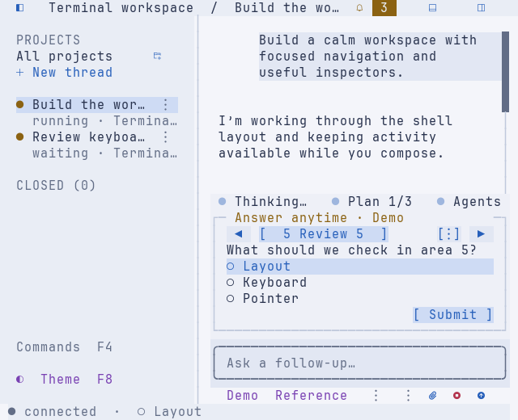
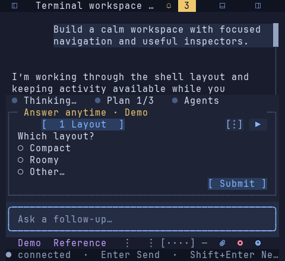

# Question navigation buttons — 2026-09-20

The captures below record the initial bracketed treatment. The user's subsequent
rounded-control request changes these to equal-height pills; see the [follow-up
review](go-thread-cards-2026-09-20.md). Reserved slots and navigation behavior remain.

The user requested filled arrow icons in reserved positions, clearer question
buttons and navigation that reveals the current question when the batch is wider
than the header. This refinement uses one header row with three-cell arrow slots
at both ends. First/last arrows are omitted without reallocating their space.
The icons are Unicode filled triangles, with explicit plain-symbol fallbacks.

Question tabs use separated single-row bracketed buttons, individual backgrounds
and a stronger, bold active state. Their widths reserve room for answered checks,
so answering alone does not move controls. The viewport shows a contiguous group
around the current question; navigation reveals its new tab. A vertical-ellipsis
menu appears only for hidden questions and provides direct access to every page.
Long labels use terminal-cell truncation; complete labels remain in focus help.
No extra header rows are added to the bounded card.

The same compact button helper now styles Submit, Options, Requests and approval
choices. Approval overflow is chosen before painting choices, preventing hidden
approval hit targets underneath the menu button. Rendering remains effect-free;
question navigation uses the existing commands, preserves drafts and never
submits answers. No dependencies, persistence or provider behavior changed.

## Validation

Validated on macOS darwin/arm64:

- `GOCACHE=/tmp/tui-go-build make check` passed gofmt, vet, all race tests and
  native build.
- Focused tests cover reserved arrow slots, disjoint button hit areas, active-tab
  visibility at 28/34/48/80/200 header columns, long Unicode labels, plain icons,
  stable answered-marker geometry, mouse/keyboard navigation across nine pages,
  overflow-menu selection and preservation of prompt/answer drafts. Narrow
  approval overflow has no covered approval targets. Existing question submit,
  retry, resize, lifecycle and input tests also pass.
- `python3 scripts/pty_smoke.py --artifacts /private/tmp/tui-question-tabs-pty-verified`
  passed all 38 native PTY checks using an isolated fixture server. These include
  pointer activation of filled arrows, hidden Next at the last page, question
  overflow, direct tab selection, explicit Submit and preserved radio/checkbox/
  text answers. The initial harness selected the new question ellipsis while
  checking composer overflow; the corrected harness scopes each selector to its
  own row. See the [report](go-question-tabs-captures/pty-report.json) and
  [captured question review](go-question-tabs-captures/pty-question-review.txt).
- `TUI_GO_CAPTURE_DIR=/private/tmp/tui-question-tabs-captures GOCACHE=/tmp/tui-go-build go test ./internal/tui -run TestQuestionReviewCaptures`
  generated 11 actual View frames. The five below were visually reviewed.
- Git diff whitespace and local documentation links pass. Changes affect
  presentation and existing action routing; no server writes, answer submission
  or approval is triggered by rendering or overflow layout.

The pictures are static renders of actual Go View output, using JetBrains Mono
Nerd Font Mono Regular at 15 px on a 10×20 cell grid. Compressed ANSI/SVG sources
are adjacent. Native PTY checks establish input behavior, not compatibility with
every GUI terminal/font, SSH or tmux configuration. Provider question integration
remains part of the next ACP slice.

The native binary is rebuilt. From `apps/go`, run `./bin/tui-go`; use `make build`
when rebuilding later. Relaunch the TUI to load the change; no server restart
is needed.

