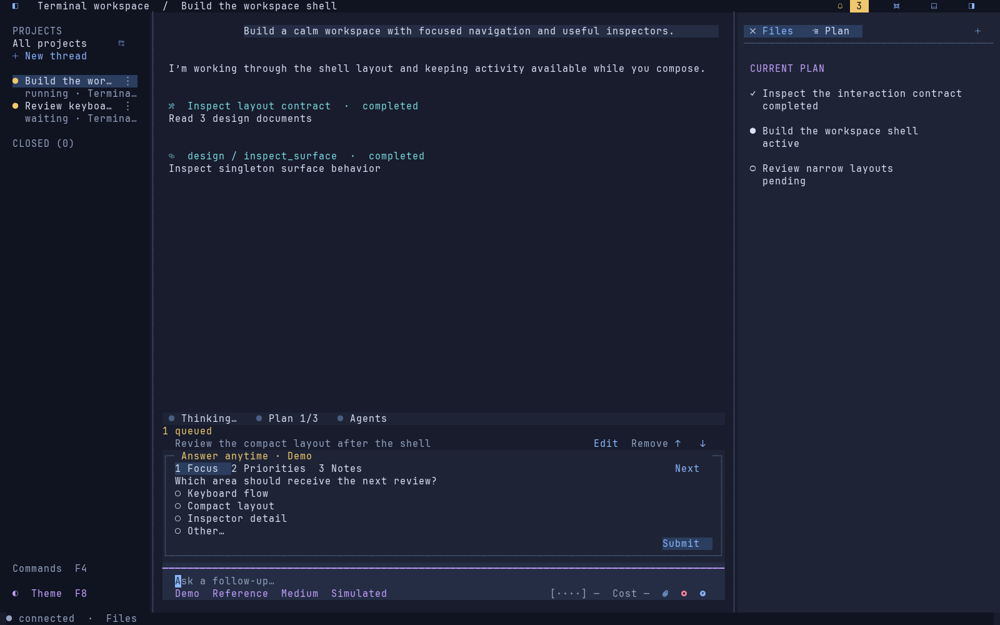
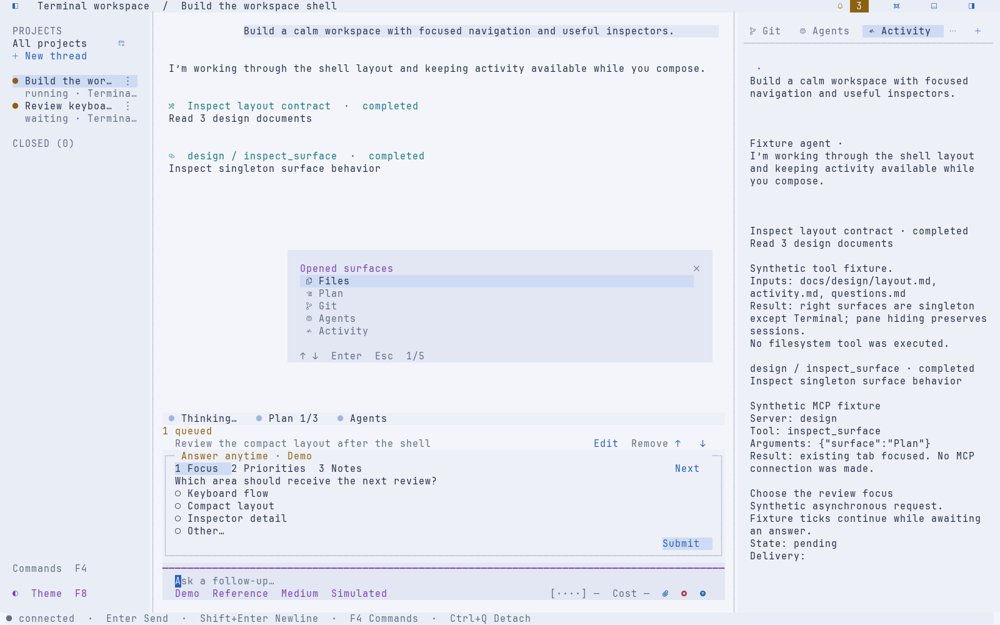
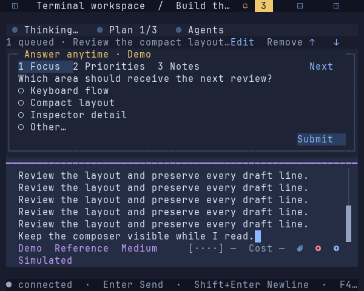
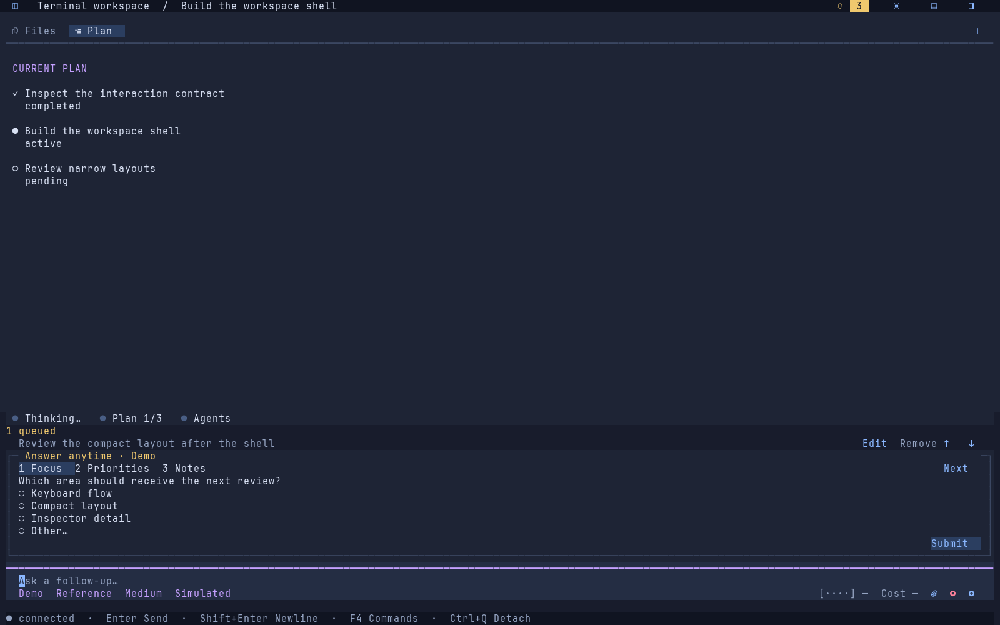

# Close controls and composer spacing — 2026-09-20

The subsequent [responsive footer review](go-footer-overflow-2026-09-20.md)
supersedes the narrow wrapping behavior recorded below.

The user requested centered close icons, inset composer controls, and settings
left-aligned on the same row as the right-aligned Send/action group. The menu
header's three-cell close target previously painted its glyph at the left edge.
Settings and actions also occupied separate rows extending to the pane edges.

Close targets now center their glyphs/text by terminal cell width. Tab labels
still select; their separate icon areas still close. Prompt text and settings/
actions share two-cell side gutters, reducing them only at tiny widths. The
layout reserves the right action group on the first settings row. When needed,
usage compacts to its clickable gauge, with billing/cost in its inspector and
focus help; remaining settings wrap below. Selected/effective differences and
recovery controls remain visible. Maximized surfaces use the same footer layout.
There is no dependency, storage, provider-setting or server-lifecycle change.

Validation on macOS darwin/arm64:

- `GOCACHE=/tmp/tui-go-build make check`: formatting, vet, all race tests and
  native build pass.
- Existing geometry, input and action tests pass. Focused checks cover disjoint
  inset controls, agent/model and Send sharing a row at 44/48/72/120 columns,
  a single footer row at ordinary widths, centered tab/menu close targets, and
  menu close preserving the underlying surface.
- `python3 scripts/pty_smoke.py --artifacts /private/tmp/tui-spacing-pty` exercises
  native input, questions, pointer controls, resizing, persistence and terminal
  cleanup with an isolated fixture server: all 29 checks pass. See the [report](go-spacing-captures/pty-report.json).
- Twelve deterministic View frames generated with `TestPolishedViewCaptures`.
  Four representative frames below were visually reviewed, including dark/light,
  tab hover, modal close, narrow wrapping and maximized composition.

These are static renders of actual Go View output using JetBrains Mono Nerd Font
Mono Regular at 15 px on a 10×20 cell grid, not screenshots from the user's
terminal. Adjacent `.ansi.gz` and `.svg.gz` files preserve the styled source and
rendering. Exact glyph pixel placement still depends on terminal font metrics.
No new actual Omarchy/SSH or GUI-terminal compatibility claim is made.

